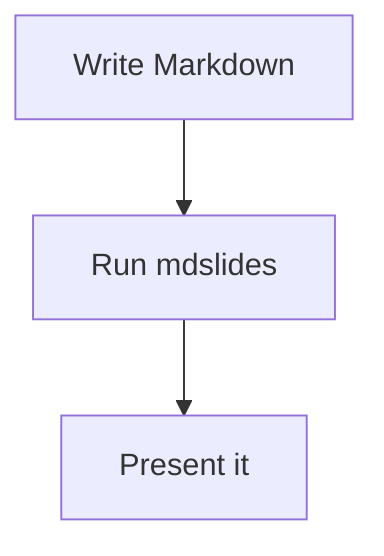

# mdslides

**Turn a Markdown file into a live, presentable deck — no slide software,
no export step, no leaving your editor.**

Write your design doc, your runbook, your team update the way you already
write everything: as a `.md` file. Run one command, and it becomes a
keyboard-navigable, PPT-style deck in your browser that updates the moment
you hit save.

```
go build -o mdslides ./cmd/mdslides
./mdslides your-notes.md
```

That's the whole setup. One static binary, no npm, no build step, no
account, nothing phoning home.

## Why

Design docs and READMEs already hold the content of a presentation —
headings, a few images, some structure. Recreating that in slide software
is duplicated work, and the moment the doc changes, the slides drift out
of sync. mdslides skips the duplication: the Markdown file *is* the deck,
always current, editable in whatever tool you already write Markdown in.

## Features

- **Headings become slides.** Every `#` heading starts a new slide — no
  extra syntax to learn for the common case.
- **Images arrange themselves.** One image, and it sits beside your text.
  Two, three, four — mdslides picks a side-by-side, stacked, or bento grid
  layout automatically, so you never hand-write CSS to make a screenshot
  look right. More than four, and the rest flow onto their own page under
  the same heading instead of overcrowding one screen.
- **`---` for manual control.** Don't like the automatic split? Drop in a
  thematic break anywhere and force a new page yourself.
- **Diagrams, not diagram *descriptions*.** A ` ```mermaid ` fenced code
  block — flowcharts, sequence diagrams, and everything else Mermaid
  supports — renders as a real diagram, not a code block.
- **GitHub-flavored Markdown.** Tables, strikethrough, and task lists all
  render properly, not as literal pipe characters.
- **Live reload.** Edit the source file in any editor; the browser tab
  updates on save. No extension required — it's built into the server.
- **Light and dark themes.** Follows your OS preference by default, with a
  toggle to override it, remembered across reloads.
- **One binary.** Every asset (HTML, CSS, JS, templates) is compiled in
  via `go:embed`. Copy the binary anywhere; there's nothing else to ship.

## Usage

```
./mdslides <file.md> [-port 8080] [-no-open]
```

| Flag | Default | Meaning |
|---|---|---|
| `-port` | `8080` | Port to serve the deck on |
| `-no-open` | off | Don't launch a browser automatically |

**In the browser:** `→` / `Space` for the next slide, `←` for the previous
one, `Home`/`End` to jump to the first/last, and the moon/sun button
(bottom right) to toggle the theme.

## Writing decks

You're writing plain Markdown — this is the part that's specific to how
mdslides interprets it:

````markdown
# A slide

Regular text, lists, tables, and code all render normally.


An image on its own line is pulled out and placed next to the text
automatically — add three more on consecutive lines and you get a grid.

---

A `---` starts a new page under the same heading, on demand.


````

See [`testdata/sample.md`](testdata/sample.md) for a file exercising every
layout and Markdown feature at once — a good reference while writing your
own.

## How it's built

mdslides is also a from-scratch example of a small Go CLI structured
around clean package boundaries — parser, layout engine, renderer, and
server each own exactly one concern, with a documented reason for every
boundary. If you're reading the source to learn from it (or to extend
it), start with [`docs/ARCHITECTURE.md`](docs/ARCHITECTURE.md); the
product-level design reasoning (why automatic image layout works the way
it does, why `---` exists) is in [`docs/HLD.md`](docs/HLD.md).

## Contributing

```
make check   # gofmt, go vet, go test, go build — the same sequence CI would run
make demo    # build and run against testdata/sample.md
```

`docs/ARCHITECTURE.md` ends with a set of scoped exercises (adding a
second `SourceWatcher` implementation, threading a new CLI flag through
the pipeline, adding speaker notes) if you're looking for a well-defined
first change to make.

Editor integrations (a VS Code extension, a Neovim plugin) that shell out
to this binary are the natural next layer, not yet built — contributions
there are especially welcome.

## License

MIT — see [`LICENSE`](LICENSE).
