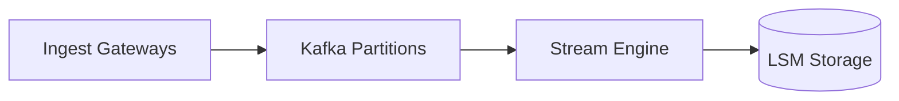

# mdslides

**Turn any Markdown file into a live, presentable browser deck — with no slide software, no export step, and no leaving your editor.**

Write your design docs, runbooks, and team updates in plain Markdown. Run one command, and it becomes a responsive, keyboard-navigable slide deck in your browser that updates the moment you hit save.

```bash
# Install with one command
curl -fsSL https://raw.githubusercontent.com/SXsid/mdslides/main/install.sh | bash

# Serve your presentation
mdslides presentation.md
```

mdslides is distributed as a single static binary with zero runtime dependencies. There is no Node.js, no npm, no bundler, and nothing phoning home.

---

## Why mdslides

Design docs and READMEs already contain the primary content of technical presentations: headings, structured narrative, tables, and architectural diagrams. Recreating this content in slide presentation software produces duplicate work, and as soon as documentation changes, slides drift out of date.

mdslides removes the duplication entirely. Your Markdown file remains the single source of truth, editable in whatever editor you prefer, while automatically rendering as a presentation-grade deck.

---

## Key Features

- **Headings as Slides**: Every primary heading (`#`) automatically begins a new slide.
- **Automatic Bento Layouts**: Standalone images configure themselves. One image sits beside your text; two stack; three and four assemble into balanced bento grids. More than four flow into continuation screens under the same heading.
- **Real-Time Live Reload**: When you save your Markdown file in any text editor, the connected browser updates instantly via Server-Sent Events.
- **Native Mermaid Diagrams**: Fenced code blocks with ````mermaid ```` render as live vector diagrams on load instead of raw code.
- **Full GitHub-Flavored Markdown**: Tables, task lists, code blocks, blockquotes, and strikethrough render with clean, professional typography.
- **Integrated Theme System**: Automatic support for OS light and dark color schemes, with manual keyboard toggles and persistent preferences.
- **Single Self-Contained Binary**: All HTML templates, CSS styles, and ES modules are embedded via Go `embed`. Copy the binary anywhere and run.

---

## Installation

### Method 1: Universal Shell Script (Linux and macOS)

Download and install the pre-compiled binary matching your operating system and architecture:

```bash
curl -fsSL https://raw.githubusercontent.com/SXsid/mdslides/main/install.sh | bash
```

### Method 2: Direct Download from GitHub Releases

Pre-compiled standalone binaries are available for Linux, macOS, and Windows from [GitHub Releases](https://github.com/SXsid/mdslides/releases):

| Platform | Architecture | Binary Name |
|---|---|---|
| Linux | x86_64 (`amd64`) | `mdslides` |
| Linux | ARM64 (`arm64`) | `mdslides` |
| macOS | Apple Silicon (`arm64`) | `mdslides` |
| macOS | Intel (`amd64`) | `mdslides` |
| Windows | x86_64 (`amd64`) | `mdslides.exe` |
| Windows | ARM64 (`arm64`) | `mdslides.exe` |

For complete release verification steps, see [docs/DISTRIBUTION.md](docs/DISTRIBUTION.md).

### Method 3: Go Toolchain

If Go is installed on your workstation:

```bash
go install github.com/SXsid/mdslides/cmd/mdslides@latest
```

### Method 4: Build from Source

```bash
git clone https://github.com/SXsid/mdslides.git
cd mdslides
make build
```

---

## Quick Start

Create a new Markdown file, for example `talk.md`:

````markdown
# High-Throughput Stream Processing

We redesigned our pipeline architecture to handle 
500,000 events per second with sub-10ms latency.

- Zero-copy deserialization
- Partition-aware buffering
- Dedicated worker thread pools


---

# Verification Benchmarks

| Ingestion Engine | Throughput (msg/s) | p99 Latency |
|---|---|---|
| Legacy Pipeline | 42,000 | 185ms |
| New Architecture | 512,000 | 7.8ms |

---

# Cluster State Machine


````

Start the presentation server:

```bash
mdslides talk.md
```

Your browser will open `http://localhost:8080/` automatically. As you edit `talk.md`, your browser updates whenever you save.

---

## CLI Reference

```
mdslides <file.md> [flags]
```

| Flag | Default | Description |
|---|---|---|
| `-port` | `8080` | Port number to serve the presentation on |
| `-no-open` | `false` | Do not launch the default web browser automatically |
| `-version`, `-v` | `false` | Print binary version information and exit |

---

## Browser Navigation and Controls

| Key / Action | Function |
|---|---|
| `→` or `Space` | Advance to the next slide |
| `←` | Return to the previous slide |
| `Home` / `End` | Jump to the first or last slide |
| `F` | Toggle fullscreen presentation mode |
| `T` | Toggle light / dark theme |
| `?` | Toggle keyboard shortcuts cheat sheet |
| `Esc` | Close shortcuts cheat sheet |

The floating control bar (HUD) at the bottom of the screen provides quick access to slide navigation, fullscreen mode, theme toggles, and help dialogs.

---

## Authoring Decks

mdslides interprets standard Markdown constructs to determine presentation layout:

- **Headings (`#`)**: Each top-level heading begins a new slide.
- **Thematic Breaks (`---`)**: Force a page split under the current heading.
- **Image Positioning**: Standalone images are extracted from text flow and organized automatically based on count (1-4 images) and source order.
- **Diagrams**: Fenced ` ```mermaid ` blocks are rendered as vector graphics.

For comprehensive examples and layout guidelines, read the [Slide Authoring Guide](docs/AUTHORING.md).

---

## Editor Integration

### VS Code

[`extension/`](extension/) is a VS Code extension that renders the same decks in
a webview beside your editor — no binary required, and no `mdslides` install.

- The preview updates **as you type**, not on save, because it reads the editor
  buffer instead of watching the file.
- Moving the cursor in the Markdown jumps the preview to that slide.
- **Export Deck to Standalone HTML** writes a single self-contained file — CSS,
  viewer script, and images all inlined — that opens anywhere.

```bash
cd extension
npm install
npm run vsce-package     # -> extension/mdslides-<version>.vsix
code --install-extension mdslides-0.1.0.vsix
```

`extension/src/deck/` is a TypeScript port of `internal/markdown`,
`internal/layout` and `internal/render`, so the slide rules, layout
classification and `.screen.layout-*` markup are the same in both. The
stylesheets are not duplicated at all: `extension/scripts/sync-assets.mjs`
copies `internal/render/web/css/*.css` on every build, keeping one source of
truth for how a deck looks. See [extension/README.md](extension/README.md).

---

## Architecture

mdslides is engineered with strict package boundaries and single-responsibility components:

```
[Markdown File]
      |
      v
markdown.ParseFile   -- goldmark (+GFM) AST traversal. Emits Deck structure.
      |
      v
layout.Classify      -- Pure function: image count and order -> grid classification.
      |
      v
render.HTML          -- Deck + layout decisions -> single self-contained HTML document.
      |
      v
server.Server        -- Serves HTML, monitors directory, broadcasts SSE reloads.
      |
      v
[Web Viewer Client]  -- Modular ES scripts: nav, theme, live-reload, diagrams, shortcuts.
```

- **Clean Layering**: Knowledge flows strictly downward. `layout` and `markdown` have zero awareness of HTML or HTTP.
- **Minimal Interfaces**: The only interface in the codebase is `SourceWatcher`, which abstracts filesystem notifications to enable fast unit testing with synthetic watchers.
- **Zero Cache Invalidation**: The server re-parses source files on each request, ensuring live reload is always synchronized with disk state.

For deeper technical details, refer to:
- [docs/ARCHITECTURE.md](docs/ARCHITECTURE.md) — Internal package design, pipelines, and extension points.
- [docs/HLD.md](docs/HLD.md) — High-level product and layout design decisions.
- [docs/DISTRIBUTION.md](docs/DISTRIBUTION.md) — Cross-platform compilation, release packaging, and distribution workflows.

---

## Contributing and Development

```bash
make check           # Run formatting checks, vet, unit tests, and build
make demo            # Build and serve testdata/sample.md
make dist            # Cross-compile binaries for Linux, macOS, and Windows
make release-local   # Package compressed archives with SHA-256 checksums
```

All contributions should maintain package boundaries, pass `make check`, and adhere to clean, professional documentation standards without emojis.

---

## License

MIT License. See [LICENSE](LICENSE) for details.
