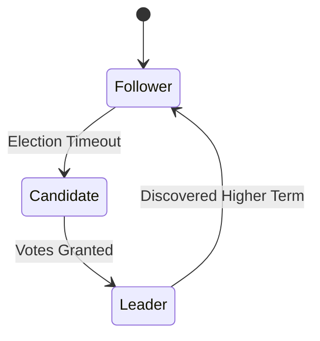

# Slide Authoring Guide

This guide details syntax specifications, layout rules, and authoring tips for building presentation decks with mdslides.

---

## Core Principles

1. **Your Document is the Presentation**: Do not maintain two copies of the same information. Write your design doc, runbook, or update in Markdown; mdslides presents it directly.
2. **Standard Markdown First**: Write normal Markdown. mdslides uses standard syntactic constructs (headings, thematic breaks, image links) to determine presentation structure without requiring custom frontmatter or proprietary tags.
3. **Responsive Automatic Layout**: mdslides analyzes your content structure (such as image count and placement order) and selects the appropriate grid layout automatically.

---

## Slide Structure

### 1. Headings as Slides

Every primary heading (`#`) initiates a new slide:

```markdown
# Slide One: Introduction

This content belongs to slide one.

# Slide Two: Technical Details

This content belongs to slide two.
```

Secondary and tertiary headings (`##`, `###`) are rendered as subheadings inside the current slide rather than triggering a new slide:

```markdown
# Architecture Overview

## Data Ingestion Layer
Incoming records are buffered in memory before being batched.

## Storage Engine
Log-structured merge tree optimized for high write throughput.
```

### 2. Manual Page Splits (`---`)

When you want to divide a long topic across multiple visual pages while keeping the same title, use a thematic break (`---`):

```markdown
# Database Migration Plan

Step 1: Deploy schema additions to production.
Step 2: Dual-write traffic to both databases.

---

Step 3: Backfill historical records from cold storage.
Step 4: Cut read traffic over to the target database.
```

The second page will appear under the same `# Database Migration Plan` heading without needing to repeat the heading in your source file.

---

## Automatic Image Layout Engine

mdslides automatically classifies slides based on the number of images present on each page.

| Image Count | Layout Kind | Layout Description |
|---|---|---|
| `0` | `layout-text` | Clean typography centered within a readable measure (68ch). |
| `1` | `layout-split` | Two equal columns: text on one side, image on the other. |
| `2` | `layout-stack` | Two images stacked vertically in one column, text in the opposite column. |
| `3` | `layout-bento-3` | Asymmetric bento grid: 1 primary feature image, 2 secondary images, text block. |
| `4` | `layout-bento-4` | 2x2 image grid with a top caption strip. |
| `> 4` | Continuation | First 4 images render as a 2x2 grid; remaining images flow to a `(cont.)` screen. |

### Source Order Preservation

If an image is placed **before** paragraph text in the source Markdown, mdslides displays the image first (on the left side in split and stacked layouts). If the text appears first, the text is positioned on the left.

Example of text first:
```markdown
# Deployment Topology

Our microservices are distributed across three availability zones.


```

Example of image first:
```markdown
# Deployment Topology


Our microservices are distributed across three availability zones.
```

---

## Native Mermaid Diagrams

mdslides includes native support for Mermaid.js diagrams. Fenced code blocks with the `mermaid` language identifier are rendered as vector graphics:

````markdown
# Consensus State Machine


````

Flowcharts, sequence diagrams, class diagrams, and entity-relationship diagrams are all supported and adapt automatically to the active theme.

---

## Rich Markdown Elements

### Tables

GitHub-Flavored Markdown tables are styled with clear row striping and borders:

```markdown
# Storage Engine Benchmarks

| Metric | B-Tree | LSM-Tree |
|---|---|---|
| Random Write Throughput | 18,000 op/s | 145,000 op/s |
| Point Lookup Latency | 0.8ms | 1.4ms |
| Storage Amplification | 1.4x | 1.8x |
```

### Code Blocks

Code blocks use fixed-width typography with syntax block framing:

````markdown
# Initialization

```go
func StartEngine(cfg Config) (*Engine, error) {
    db, err := leveldb.OpenFile(cfg.Path, nil)
    if err != nil {
        return nil, fmt.Errorf("open storage: %w", err)
    }
    return &Engine{db: db}, nil
}
```
````

### Task Lists and Checklists

Task lists render with styled interactive checkboxes:

```markdown
# Production Readiness Checklist

- [x] Automated regression suite passes
- [x] Load testing verified at 2x peak traffic
- [x] Rollback runbook verified by SRE team
- [ ] Final sign-off from compliance
```

---

## Presentation Navigation and Controls

When viewing your presentation in the browser:

| Action | Shortcut / Control | Description |
|---|---|---|
| Next Slide | `→` or `Space` or `>` HUD Button | Advances to the next slide or continuation page. |
| Previous Slide | `←` or `<` HUD Button | Navigates back to the previous slide. |
| First / Last Slide | `Home` / `End` | Jumps directly to slide 0 or the final slide. |
| Fullscreen Mode | `F` or Fullscreen HUD Button | Expands presentation to borderless full display. |
| Theme Toggle | `T` or Theme HUD Button | Toggles between Dark and Light color palettes. |
| Shortcuts Help | `?` or Help HUD Button | Displays the keyboard shortcuts reference dialog. |
| Dismiss Modal | `Esc` | Closes the open shortcuts cheat sheet. |
| Live Reload | Automatic on Save | Browser updates instantly when the file is saved. |
