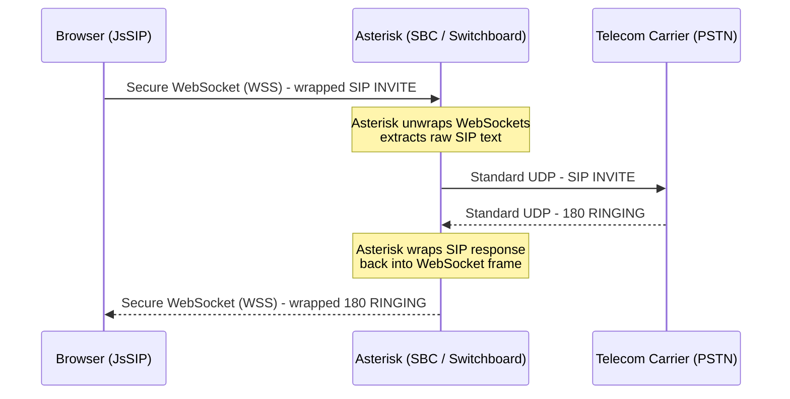
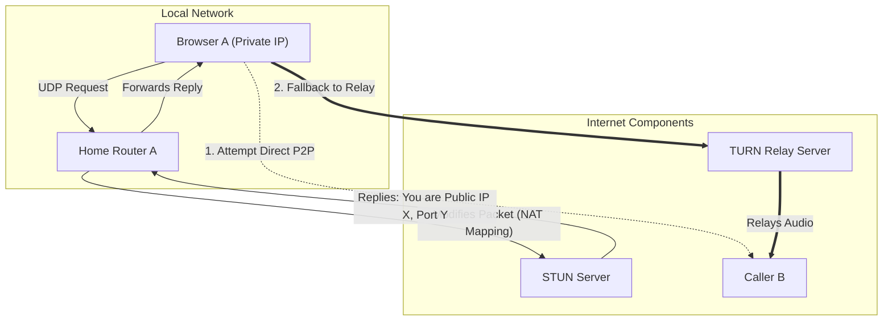
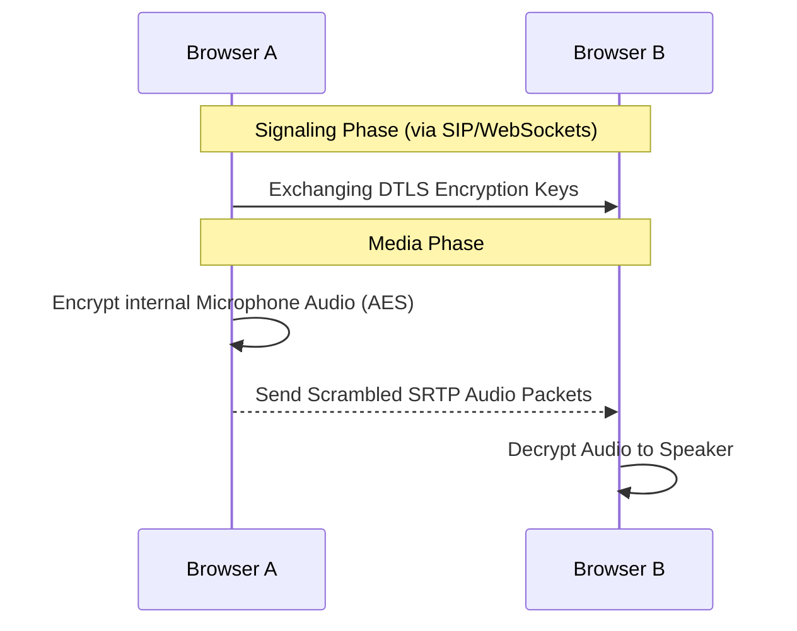

# How Virtual Calling Works (Working of VOIP Calling)

Virtual calling operates over the internet using **VoIP** (Voice over Internet Protocol). Unlike traditional PSTN (Public Switched Telephone Network) lines that use physical circuit switching, VoIP works by converting analog voice signals into digital packets and transmitting them over IP networks. 

Modern browser-based calling primarily relies on the interoperability of two major protocols: **SIP** and **WebRTC**.

---

## 1. SIP (Session Initiation Protocol) & WebSockets

SIP is the standard protocol for initiating, modifying, and terminating real-time communication sessions (voice, video, and messaging). 
- **Signaling First:** SIP does not transmit the actual voice data. Instead, it acts like a digital switchboard operator—it rings the other party, negotiates the parameters of the call, and sets up the connection.
- **SDP (Session Description Protocol):** Inside the SIP messages, SDP is used to negotiate media capabilities (e.g., "I support Opus audio codec and am listening on IP 192.168.1.5, port 5004").

### Why WebSockets and JsSIP?
For security reasons, web browsers operate in a strict "sandbox." This prevents malicious websites from sending arbitrary network packets (like raw UDP or TCP) directly into your private network or across the internet. Therefore, standard SIP (which relies on UDP/TCP) cannot be natively sent from a browser.

Here is how the industry solves this:
- **WebSockets:** While browsers block raw UDP/TCP, they legally permit **WebSockets**—a persistent, bi-directional connection over standard web ports (HTTPS). 
- **JsSIP:** This is a JavaScript library that acts as a "softphone" inside the browser. Because it can't send a raw SIP packet over the network, JsSIP formats the standard SIP message as text and wraps it securely inside a WebSocket frame to bypass the browser's restrictions.
- **Asterisk (The Bridge):** Asterisk is an immensely popular, open-source PBX (Private Branch Exchange) software—essentially the digital telephone switchboard at the heart of the telephony server. When Asterisk receives these WebSocket frames from the browser, it actively "unwraps" them to read the raw SIP text. From there, Asterisk acts as the middleman, proxying this browser-based SIP conversation into standard, global SIP/UDP traffic so that the call can seamlessly route to traditional telecom carriers.

---

## 2. WebRTC (Web Real-Time Communication) & NAT Traversal

WebRTC allows browsers and mobile applications to have real-time peer-to-peer media communications without external plugins. Because devices are almost always hidden behind internet routers on private networks, they need assistance bypassing those routers to send media directly to each other. 

WebRTC uses the **ICE** (Interactive Connectivity Establishment) framework to orchestrate this:

### STUN (Session Traversal Utilities for NAT)
- **The Analogy:** Imagine you live in a large apartment building. If you want a friend to mail you a package (voice data), your friend only knows the building's main street address (the router's Public IP), but they don't know your specific apartment number (your computer's Private IP). A STUN server is simply an external helper you call to ask, "Hey, from the outside world, what does my building's address and door number look like?" Once the STUN server tells you your public-facing address, you share that address with the person trying to call you so they can send the audio data directly to your door.
- **How it works technically:** When your computer sends a request to the STUN server, the packet passes through your local router. The router modifies the packet, stamping its own Public IP address and a temporary port number onto it so the outside world knows where it came from (this is called a NAT mapping). When the STUN server receives the packet, it looks at that newly stamped Public IP and port, and replies back to your computer saying, "I see you coming from IP X, Port Y." Your browser now knows its own public address and shares it with the other caller via the WebSocket signaling channel.

### TURN (Traversal Using Relays around NAT)
- **The Analogy:** If the apartment building has highly aggressive security guards (strict firewalls) that block all direct packages from unknown senders, STUN will fail. The system falls back to a TURN server—a trusted intermediary facility. Both you and your friend send your packages to the TURN facility, and the facility forwards them to the respective recipient.
- **How it works technically:** If direct peer-to-peer connection is blocked, your browser connects to the TURN server over standard allowed internet ports. The TURN server dynamically allocates a dedicated public IP and port on its own infrastructure specifically for your call. Your browser tells the person calling you, "Send all your audio to the TURN server at Address Z." When the other person sends audio packets to Address Z, the TURN server receives them and immediately relays them down the established connection to your private computer. Because all traffic flows through this central hub rather than peer-to-peer, it bypasses strict firewall limitations, but requires significant server bandwidth.

---

## 3. Media Transmission (RTP / SRTP)

Once ICE candidates are verified and a routing path (Direct or via TURN) is established, the actual voice data begins flowing. 

- **RTP (Real-time Transport Protocol):** Used to deliver the audio packets. RTP prioritizes speed and low latency, favoring continuous delivery even if it means occasional audio fragments are lost. 
- **SRTP (Secure RTP) & Encryption:** Standard RTP is unencrypted. However, WebRTC mandates that all media be perfectly secure. This is where **DTLS** (Datagram Transport Layer Security) comes in. During the initial SIP/WebSocket signaling setup, both the caller and the receiver automatically generate cryptographic keys. They safely exchange these keys over the secure signaling channel. Once both sides have the agreed-upon keys, their browsers use them to apply military-grade AES encryption to all outgoing RTP voice packets (turning RTP into SRTP). Because the audio packets are mathematically scrambled *before* they leave the browser, any hacker intercepting the traffic in transit will only hear meaningless static noise. 

